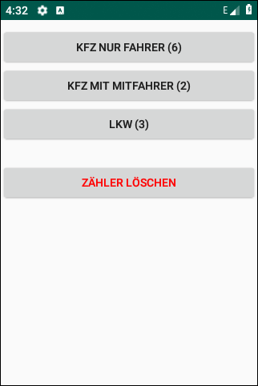
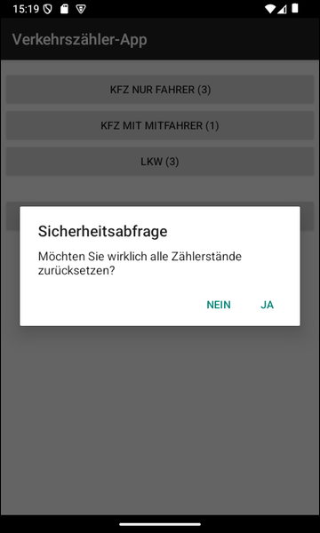

# Android-App "Verkehrszähler" (Traffic Counter) #

 

Simple Android app for manually counting the traffic on a road to demonstrate how to use an
[SQLite Database](https://developer.android.com/training/data-storage/sqlite).

 

SQL files for testing with command line program SQLite3 (e.g. *sqlite3.exe* on Windows) can be found in sub-folder [SQL](SQL/).
These files will NOT be included into the app file (APK file) generated by *Android Studio*.

 

Identifiers (names for classes, variables and methods), UI text and (JavaDoc) comments are in German only.

 

There is also a variant of this app which uses Android's ORM "Room", see 
[this repository](https://github.com/MDecker-MobileComputing/Android_Verkehrszaehler_mitRoom).

 

----

## Screenshots ##

 

  

Screenshots were taken from emulator.

 

----

## License ##

 

See the [LICENSE file](LICENSE.md) for license rights and limitations (BSD 3-Clause License).

 
<
