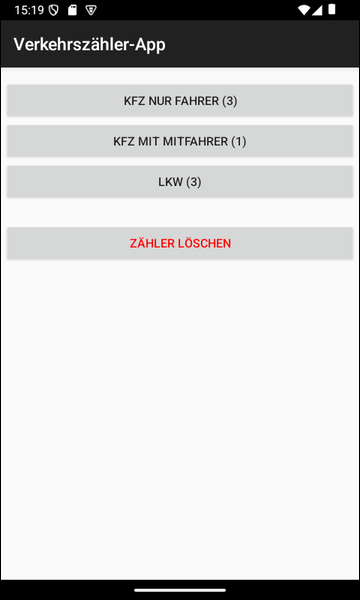

# Android-App "Verkehrszähler" #

 

Diese Repo enthält ein "Android Studio"-Projekt für eine einfache native Android-App (Java) 
zum manuellen Zählen des Verkehrs auf einer Straße, um die Verwendung einer
[SQLite-Datenbank](https://developer.android.com/training/data-storage/sqlite) 
zu demonstrieren.

 

Es gibt auch eine Variante dieser App mit dem Android-spezifischen ORM "Room", 
[diese Repo](https://github.com/MDecker-MobileComputing/Android_Verkehrszaehler_mitRoom).

 

----

## Screenshots ##

 

 &nbsp; 

 

----

## License ##

 

See the [LICENSE file](LICENSE.md) for license rights and limitations (BSD 3-Clause License).

 
